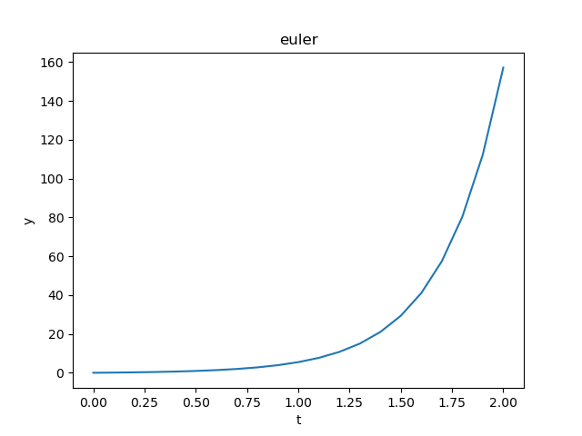
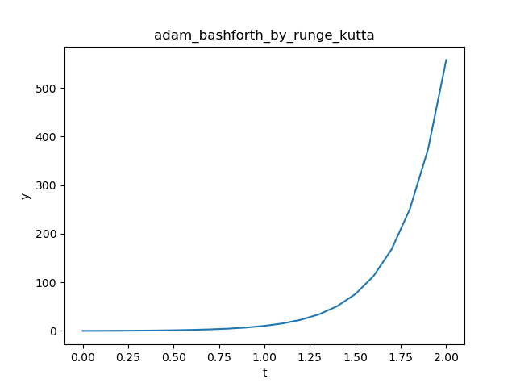

# NumericalMethods

Solve and plot differential equations in an easy way

## Requirements

* `python3`
* `matplotlib`
* `sympy`

## Running

Simply call the program with `python main.py`. Don't forget to have an input file in the same folder of the script.

## Sample graphs

